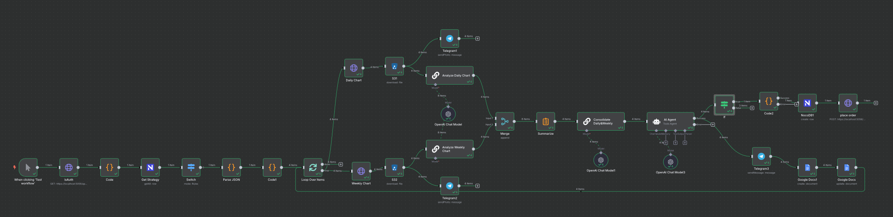

# Interactive Brokers Trading System

A sophisticated trading system that integrates with Interactive Brokers (IBKR) API to provide real-time market data analysis, technical indicators, and automated trading capabilities.


## Features

- **Real-time Market Data**: Fetches live market data from IBKR API
- **Technical Analysis**: 
  - Multiple timeframe analysis (Daily vs Weekly)
  - Advanced technical indicators:
    - Moving Averages (SMA 20, 50, 200)
    - Bollinger Bands
    - SuperTrend
    - MACD
    - RSI
    - ATR
    - Volume Analysis
- **Trading Decision Engine**:
  - Compares daily and weekly timeframes
  - Generates trading signals
  - Implements price management algorithms
- **Order Management**:
  - Smart order routing
  - Price adjustment for buy/sell orders
  - Default TIF (Time in Force) set to DAY
- **Data Persistence**:
  - Stores trading decisions in NocoDB
  - Maintains order history
  - Tracks trade performance
- **Automated Workflow**:
  - N8N workflow automation
  - LLM-powered technical analysis
  - Automated trading decisions
  - Real-time notifications

## System Architecture

The system is built using a microservices architecture with the following components:

1. **Web Application (Flask)**:
   - Handles user interface
   - Manages authentication
   - Processes trading requests

2. **Market Data Service**:
   - Fetches real-time data from IBKR
   - Processes market data
   - Calculates technical indicators

3. **Trading Engine**:
   - Analyzes market data
   - Generates trading signals
   - Makes trading decisions

4. **Order Management Service**:
   - Places orders to IBKR
   - Manages order lifecycle
   - Implements price management

5. **Data Storage (NocoDB)**:
   - Stores trading decisions
   - Maintains order history
   - Tracks performance metrics

6. **Notification Service (N8N)**:
   - Sends trade notifications
   - Alerts on order status changes
   - Provides system status updates

7. **LLM Integration**:
   - Technical analysis generation
   - Trading decision support
   - Risk assessment
   - Performance reporting

## Technical Stack

- **Backend**: Python 3.8+
- **Web Framework**: Flask
- **Data Analysis**: Pandas, NumPy
- **Technical Analysis**: Custom indicators implementation
- **Data Storage**: NocoDB
- **Workflow Automation**: N8N
- **Object Storage**: MinIO
- **Containerization**: Docker
- **AI/ML**: Gemini 2.0 Flash
- **Documentation**: Google Docs
- **Notifications**: Telegram

## Installation

1. Clone the repository:
```bash
git clone https://github.com/kihiu-ho/LLM.Trading.Bot.IBKR.N8N/
cd LLM.Trading.Bot.IBKR.N8N/
```

2. Install dependencies:
```bash
pip install -r requirements.txt
```

3. Set up environment variables:
```bash
cp .env.example .env
# Edit .env with your configuration
```

4. Start the services:
```bash
docker-compose up -d
```

## Configuration

Create a `.env` file with the following variables:

```env
IBKR_ACCOUNT_ID=your_account_id
MINIO_ACCESS_KEY=your_minio_access_key
MINIO_SECRET_KEY=your_minio_secret_key
NOCODB_API_TOKEN=your_nocodb_token
NOCODB_PROJECT_ID=your_project_id
NOCODB_TABLE_ID=your_table_id
NOCODB_ORDERS_TABLE_ID=your_orders_table_id
NOCODB_TRADES_TABLE_ID=your_trades_table_id
N8N_WEBHOOK_URL=your_n8n_webhook_url
TELEGRAM_BOT_TOKEN=your_telegram_bot_token
TELEGRAM_CHAT_ID=your_telegram_chat_id
GOOGLE_DOCS_FOLDER_ID=your_google_docs_folder_id
```

## Usage

1. Start the application:
```bash
python -m webapp.app
```

2. Access the web interface:
```
https://localhost:5056
```

3. Login with your IBKR credentials

4. Use the dashboard to:
   - View market data
   - Analyze technical indicators
   - Place trades
   - Monitor positions

## Trading Strategy

The system implements a multi-timeframe analysis strategy:

1. **Daily Analysis**:
   - Short-term trend identification
   - Entry/exit point determination
   - Volume analysis

2. **Weekly Analysis**:
   - Long-term trend confirmation
   - Support/resistance levels
   - Market structure analysis

3. **Decision Making**:
   - Combines daily and weekly signals
   - Implements risk management rules
   - Adjusts order prices based on market conditions

## N8N Workflow

The system uses N8N for workflow automation:

1. **Market Data Collection**:
   - Fetches daily and weekly charts
   - Stores in MinIO
   - Prepares for analysis

2. **Technical Analysis**:
   - LLM-powered chart analysis
   - Multi-timeframe comparison
   - Signal generation

3. **Trading Decisions**:
   - Automated decision making
   - Risk assessment
   - Order execution

4. **Documentation**:
   - Google Docs reports
   - Telegram notifications
   - Performance tracking

For detailed workflow documentation, see [N8N Workflow Documentation](docs/n8n_workflow.md)

## Contributing

1. Fork the repository
2. Create a feature branch
3. Commit your changes
4. Push to the branch
5. Create a Pull Request

## License

This project is licensed under the MIT License - see the LICENSE file for details.

## Support

For support, please open an issue in the GitHub repository or contact the maintainers. 