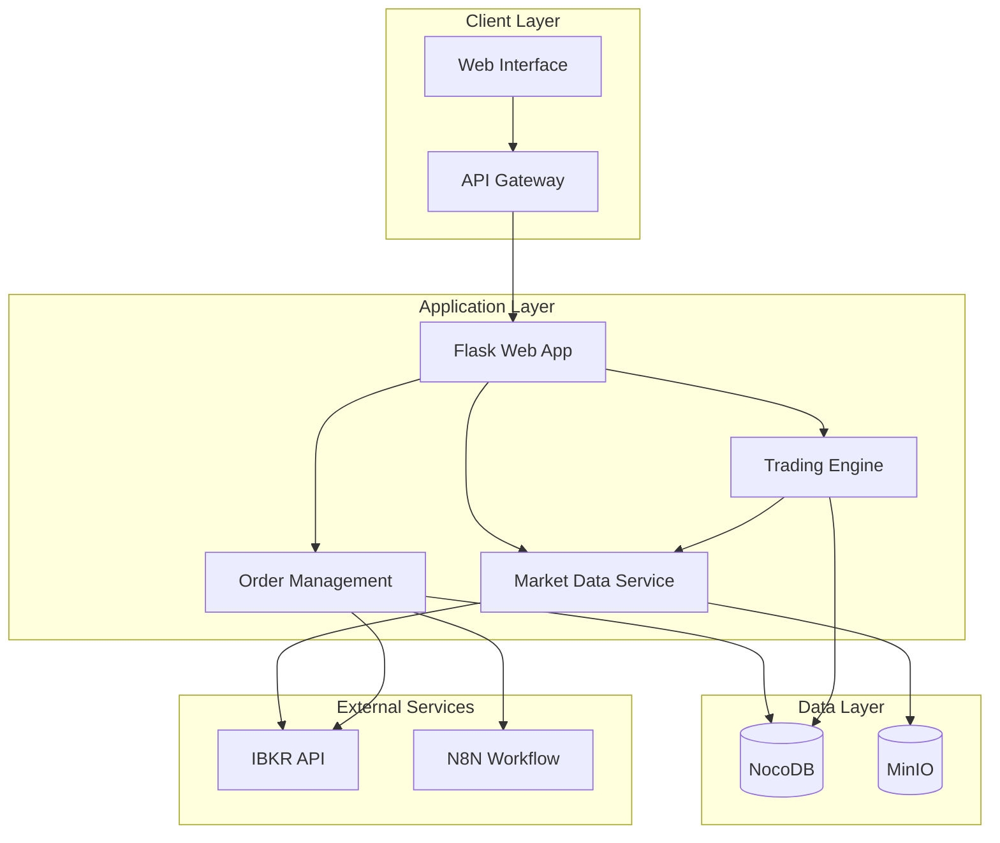
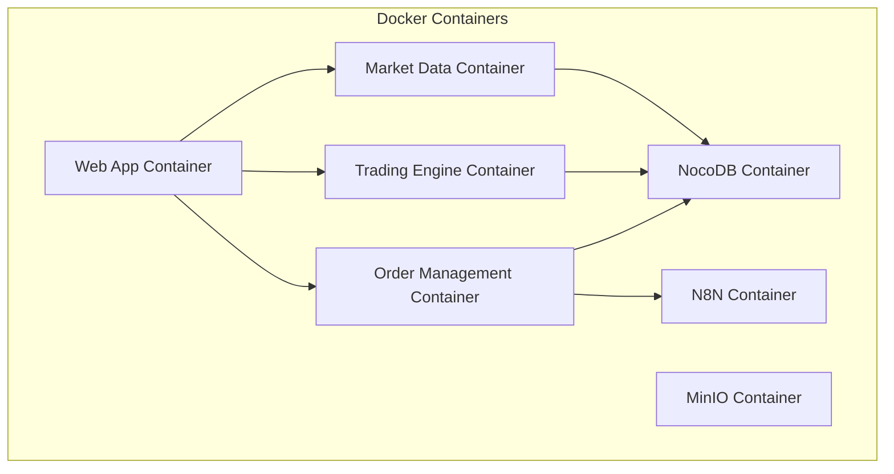

# System Architecture

## Overview

The Interactive Brokers Trading System is designed as a microservices-based architecture that integrates multiple components to provide a comprehensive trading solution. The system architecture is illustrated below:



## Component Details

### 1. Client Layer
- **Web Interface**: User-friendly dashboard for trading operations
- **API Gateway**: Handles authentication and request routing

### 2. Application Layer
- **Flask Web App**: Core application handling user requests
- **Market Data Service**: 
  - Fetches real-time data from IBKR
  - Processes market data
  - Calculates technical indicators
- **Trading Engine**:
  - Analyzes market data
  - Generates trading signals
  - Makes trading decisions
- **Order Management**:
  - Places orders to IBKR
  - Manages order lifecycle
  - Implements price management

### 3. Data Layer
- **NocoDB**:
  - Stores trading decisions
  - Maintains order history
  - Tracks performance metrics
- **MinIO**:
  - Stores technical charts
  - Caches market data
  - Manages file storage

### 4. External Services
- **IBKR API**:
  - Provides market data
  - Executes trades
  - Manages account information
- **N8N Workflow**:
  - Handles notifications
  - Manages alerts
  - Automates workflows

## Data Flow

1. **Market Data Flow**:
   ```
   IBKR API → Market Data Service → Trading Engine → NocoDB
   ```

2. **Order Flow**:
   ```
   Web Interface → Order Management → IBKR API → NocoDB
   ```

3. **Notification Flow**:
   ```
   Order Management → N8N → User Notifications
   ```

## Security

- SSL/TLS encryption for all communications
- API key authentication for external services
- Session-based authentication for web interface
- Secure storage of credentials in environment variables

## Scalability

- Microservices architecture allows independent scaling
- Containerized deployment for easy scaling
- Stateless services for horizontal scaling
- Caching layer for performance optimization

## Monitoring

- Logging of all system activities
- Performance metrics tracking
- Error monitoring and alerting
- System health checks

## Deployment

The system is deployed using Docker containers with the following structure:



## Development Workflow

1. **Local Development**:
   - Docker Compose for local environment
   - Hot-reloading for development
   - Local testing environment

2. **Testing**:
   - Unit tests for each service
   - Integration tests for service interactions
   - End-to-end testing for complete workflows

3. **Deployment**:
   - CI/CD pipeline for automated deployment
   - Version control for all components
   - Automated testing before deployment 