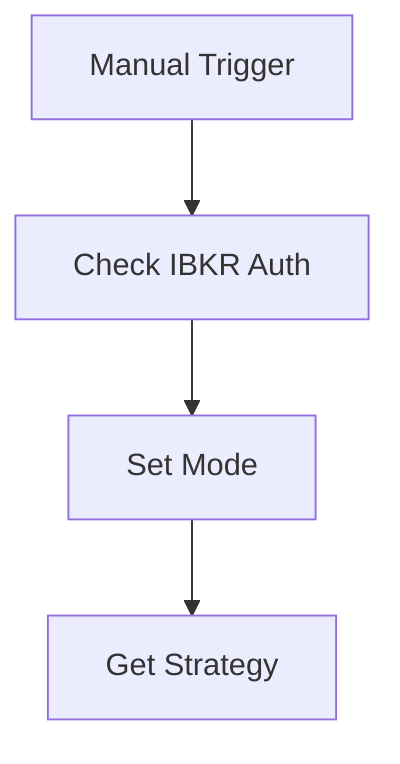
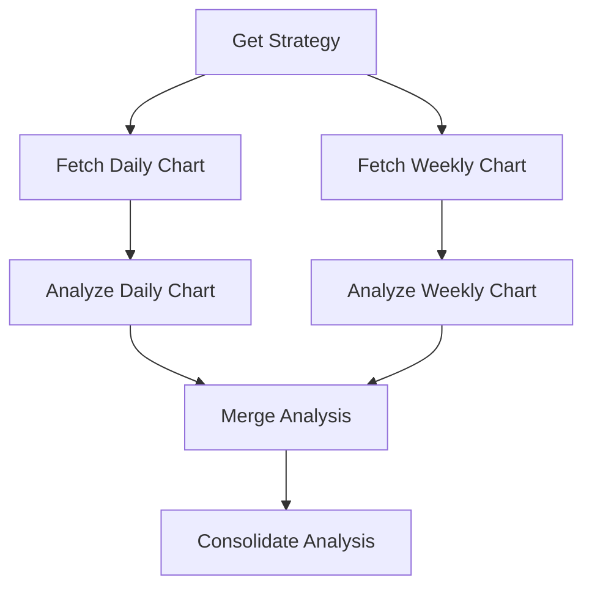
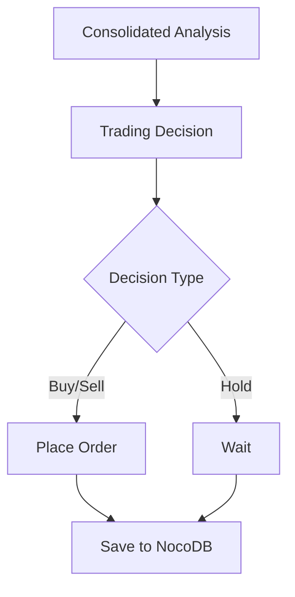

# N8N Workflow Integration

## Overview

The system uses N8N for workflow automation, integrating with LLM (Language Learning Model) for technical analysis and automated trading decisions. The workflow is designed to process market data, generate analysis, and execute trades based on predefined strategies.

## N8N flow


## Workflow Components

### 1. Authentication Flow


### 2. Market Data Analysis Flow


### 3. Trading Decision Flow


## LLM Integration

### 1. Analysis Prompts
- **Daily Chart Analysis**:
  - Price and trend overview
  - Technical indicators status
  - Entry/exit points
  - Risk assessment

- **Weekly Chart Analysis**:
  - Long-term trend confirmation
  - Support/resistance levels
  - Market structure
  - Risk management

### 2. Decision Making
- **Trading Decision Format**:
```json
{
  "code": "string",
  "type": "buy|sell|hold",
  "current_price": "decimal",
  "target_price": "decimal",
  "profit_margin": "decimal",
  "strategy_used": "string",
  "R_coefficient": "decimal"
}
```

## Notification System

### 1. Telegram Integration
- Sends technical analysis charts
- Provides trading recommendations
- Alerts on order execution
- System status updates

### 2. Google Docs Integration
- Stores detailed analysis reports
- Maintains trading history
- Tracks performance metrics
- Generates periodic reports

## Workflow Steps

1. **Initialization**:
   - Manual trigger starts the workflow
   - Checks IBKR authentication
   - Sets operation mode (online/offline)

2. **Strategy Selection**:
   - Retrieves trading strategy from NocoDB
   - Parses strategy parameters
   - Sets analysis timeframes

3. **Market Data Collection**:
   - Fetches daily and weekly charts
   - Stores charts in MinIO
   - Prepares data for analysis

4. **Technical Analysis**:
   - Sends charts to LLM for analysis
   - Generates daily and weekly analysis
   - Consolidates findings

5. **Trading Decision**:
   - Processes consolidated analysis
   - Generates trading signals
   - Calculates risk parameters

6. **Order Execution**:
   - Places orders to IBKR
   - Saves decisions to NocoDB
   - Sends notifications

7. **Documentation**:
   - Creates Google Docs report
   - Sends Telegram updates
   - Maintains trading history

## Configuration

### 1. N8N Settings
```json
{
  "telegram": {
    "chat_id": "-4688456849",
    "bot_token": "your_bot_token"
  },
  "google_docs": {
    "folder_id": "1gsx9y9kpap_vworzMndvwK3U9VpCeFan"
  },
  "llm": {
    "model": "gemini-2.0-flash",
    "temperature": 0.7
  }
}
```

### 2. Workflow Parameters
- **Chart Periods**:
  - Daily: 1D
  - Weekly: 1W

- **Analysis Timeframes**:
  - Short-term: 30 days
  - Medium-term: 180 days

- **Risk Parameters**:
  - Minimum R coefficient: 1.0
  - Minimum profit margin: 5%

## Error Handling

1. **Authentication Errors**:
   - Retries with exponential backoff
   - Notifies via Telegram
   - Logs to system

2. **Analysis Errors**:
   - Fallback to offline mode
   - Uses cached data
   - Generates error report

3. **Order Execution Errors**:
   - Retries with price adjustment
   - Sends alert to Telegram
   - Logs to NocoDB

## Monitoring

1. **Performance Metrics**:
   - Workflow execution time
   - LLM response time
   - Order execution success rate

2. **System Health**:
   - API availability
   - Resource usage
   - Error rates

3. **Trading Performance**:
   - Win rate
   - Profit factor
   - Risk-adjusted returns

## Maintenance

1. **Regular Updates**:
   - Strategy parameters
   - LLM prompts
   - Risk parameters

2. **System Optimization**:
   - Workflow efficiency
   - Resource utilization
   - Error handling

3. **Documentation**:
   - Workflow changes
   - System updates
   - Performance reports 