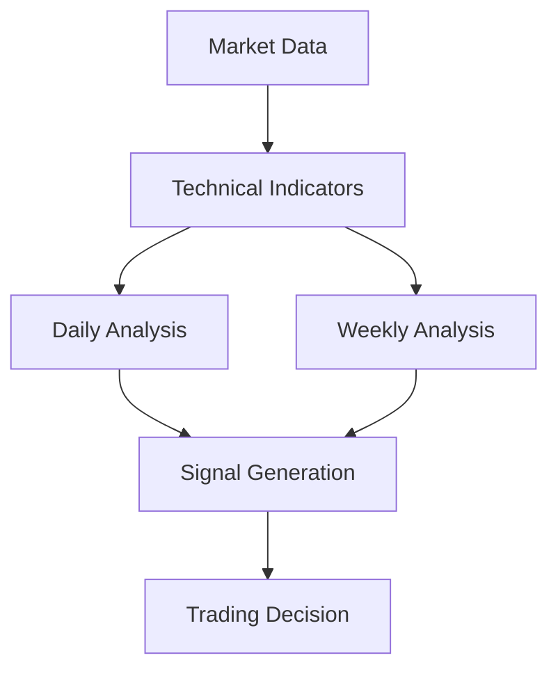

# Trading Strategy

## Multi-Timeframe Analysis

The system implements a sophisticated multi-timeframe analysis strategy that combines daily and weekly data to make trading decisions.

### Daily Analysis

The daily timeframe is used for:
1. **Short-term Trend Identification**
   - Moving Average Crossovers
   - SuperTrend Direction
   - Volume Analysis

2. **Entry/Exit Points**
   - Bollinger Band Breakouts
   - RSI Extremes
   - MACD Crossovers

3. **Price Action**
   - Support/Resistance Levels
   - Candlestick Patterns
   - Volume Profile

### Weekly Analysis

The weekly timeframe provides:
1. **Long-term Trend Confirmation**
   - 200 SMA Direction
   - Major Support/Resistance
   - Market Structure

2. **Risk Management**
   - Position Sizing
   - Stop Loss Levels
   - Take Profit Targets

3. **Market Context**
   - Sector Performance
   - Market Breadth
   - Economic Indicators

## Decision Making Process

### 1. Signal Generation



### 2. Trade Entry Rules

1. **Buy Signals**:
   - Daily SuperTrend turns bullish
   - Weekly trend is bullish
   - RSI shows oversold conditions
   - Volume confirms price action

2. **Sell Signals**:
   - Daily SuperTrend turns bearish
   - Weekly trend is bearish
   - RSI shows overbought conditions
   - Volume confirms price action

### 3. Risk Management

1. **Position Sizing**:
   - Based on account equity
   - Adjusted for volatility
   - Maximum risk per trade

2. **Stop Loss**:
   - ATR-based stops
   - Support/Resistance levels
   - Maximum loss percentage

3. **Take Profit**:
   - Risk:Reward ratio
   - Technical levels
   - Trailing stops

## Implementation

### 1. Data Collection

```python
# Daily Data
daily_data = MarketDataService.get_live_market_data(conid, period='1d', bar='1d')

# Weekly Data
weekly_data = MarketDataService.get_live_market_data(conid, period='1w', bar='1w')
```

### 2. Technical Analysis

```python
# Calculate Indicators
daily_indicators = calculate_indicators(daily_data)
weekly_indicators = calculate_indicators(weekly_data)

# Generate Signals
signals = generate_signals(daily_indicators, weekly_indicators)
```

### 3. Trade Execution

```python
# Place Order with Price Management
if signals['action'] == 'BUY':
    price_data = MarketDataService.get_optimal_order_price(conid, 'BUY')
    OrderService.place_order(
        conid=conid,
        order_type='LMT',
        price=price_data['adjusted_price'],
        quantity=calculate_position_size(),
        side='BUY',
        tif='DAY'
    )
```

## Performance Tracking

### 1. Metrics

- Win Rate
- Profit Factor
- Average Win/Loss
- Maximum Drawdown
- Sharpe Ratio

### 2. Analysis

- Trade Journal
- Performance Reports
- Risk Analysis
- Strategy Optimization

## Continuous Improvement

1. **Strategy Refinement**:
   - Backtesting results
   - Performance analysis
   - Parameter optimization

2. **Risk Management**:
   - Position sizing adjustments
   - Stop loss optimization
   - Portfolio diversification

3. **Market Adaptation**:
   - Market regime detection
   - Strategy switching
   - Parameter adaptation 